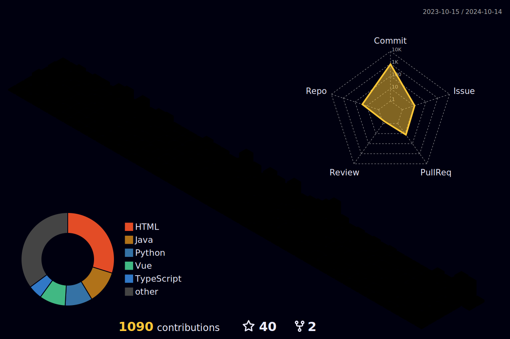

<!-- 动态打字效果 -->

<!-- 壁纸 -->

<!-- 个人资料徽标 -->
&emsp;&emsp;

  
  
  
  
  
 

  
&nbsp;

  
&emsp;&emsp;

&emsp;&emsp;

<!-- 提交分析 -->

<!-- 贪吃蛇 -->

<!-- 连续提交代码天数记录 -->

  
  
  

 

<!-- 奖杯 -->

 

<!-- 提交记录 -->
<!--  -->

