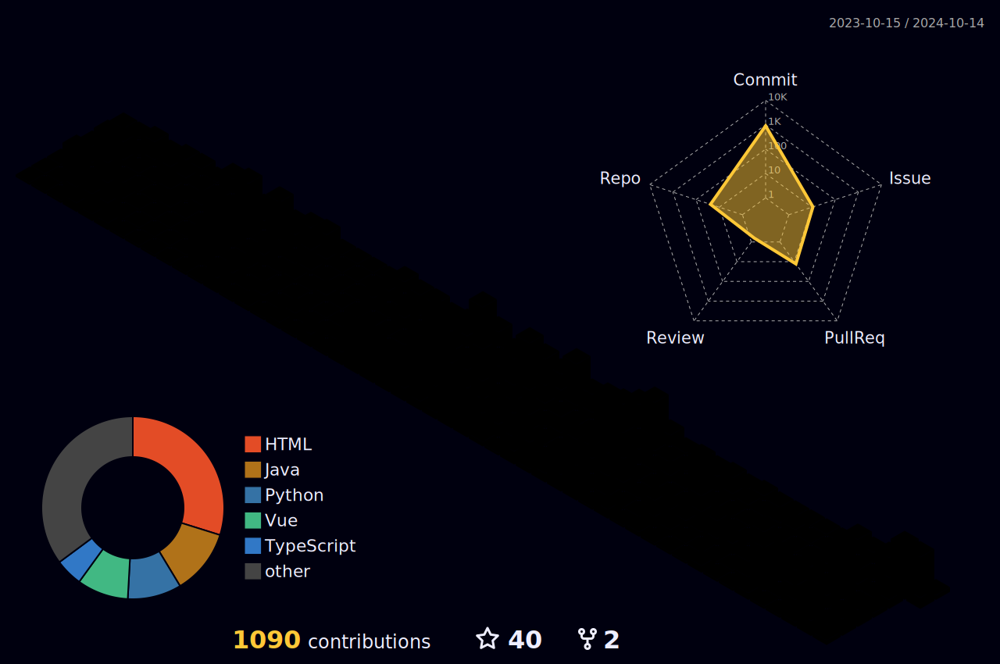

 

- 👋 Hi, I am @孤独的Lonely
- 💻 I am a back-end developer
- 🧑‍🎓 I am a senior student
- 🩷 I like reading comics 和 cartoons
- ✨ I like to play something new
- 🔗 This is my [personal blog](https://clb.pages.dev), welcome to visit
- 📧 Contact me through 1265501579@qq.com

---

<!-- 个人资料徽标 -->

    
        
  
  
  
  
 
  
&nbsp;

<!-- 各种技术栈和工具等图标 -->
&emsp;&emsp;

<!--  -->
<!--  -->

&emsp;&emsp;

<!-- 

->

<!-- 提交分析 -->
<!-- 
 
 -->

<!-- 贪吃蛇 -->

<!-- 提交记录 -->
<!--  -->
